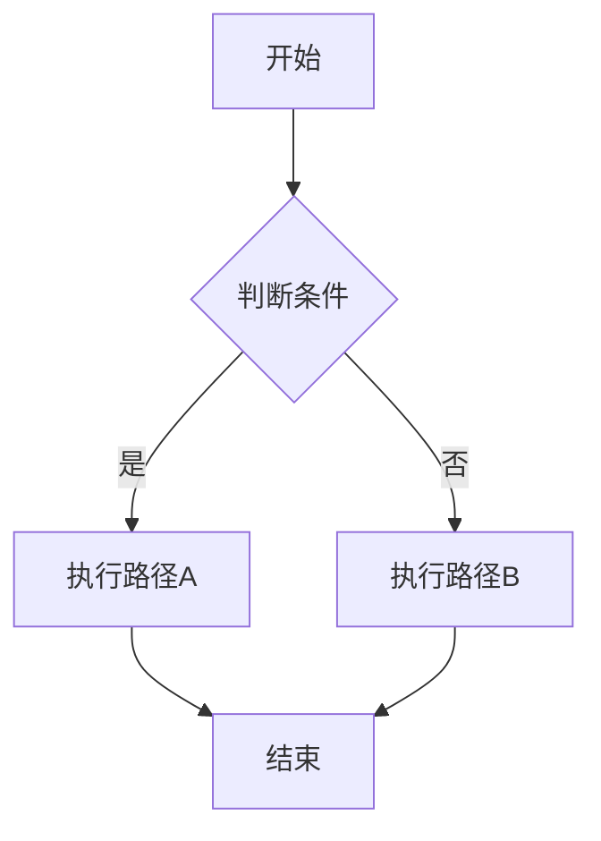

---
title: "Hexo 博客 Markdown 样式完全指南"
date: 2026-07-19
categories:
  - 教程
tags:
  - Hexo
  - Markdown
  - 博客写作
description: 一份涵盖 Hexo 博客通过 .md 文件发表文章时所有可能用到的样式写法速查手册。
index_img: /assets/picture/picture.jpg
banner_img: /assets/picture/picture.jpg
cover: /images/cover.jpg
excerpt: 一篇文章涵盖 Hexo + Fluid 主题所有 Markdown 写法。
published: true
toc: true
---

# Hexo 博客 Markdown 样式完全指南

> 一份涵盖 Hexo + Fluid 主题所有 .md 文章写法的速查手册。本文本身既是教程，也是一个可直接复用的模板。


## 0. Frontmatter 配置 —— 文章元数据

每篇 .md 文件顶部的 YAML 区块（`---` 包裹）是 Hexo 识别文章和配置样式的核心。以下是所有可用字段及说明。

**必需字段：**

- `title` — 文章标题，可加引号也可不加。如 `title: "我的标题"`
- `date` — 发布日期，决定排序。格式 `2026-07-19` 或 `"2026-07-19 14:30:00"`

**分类与标签：**

```yaml
categories:
  - 技术       # 一级分类
  - - 前端     # 二级分类（缩进加 -）
    - React
tags:
  - Hexo
  - Markdown
  - 博客写作
```

- `categories` — 支持多级分类，用缩进 + `-` 表示层级
- `tags` — 扁平列表，每个标签独立一行

**图片与封面：**

- `index_img` — 文章在首页列表中的缩略图，如 `/assets/picture/cover.jpg`
- `banner_img` — 文章页顶部横幅大图，如 `/assets/picture/banner.jpg`
- `cover` — 文章封面图（部分布局使用），如 `/images/cover.jpg`

**摘要与描述：**

- `description` — SEO 描述，也显示在列表卡片中，如 `"这是一篇关于..."` 
- `excerpt` — 自定义摘要，会覆盖首页自动截取。不写则用 `<!-- more -->` 或自动截断

**控制字段：**

| 字段 | 类型 | 默认值 | 说明 |
| :--- | :--- | :--- | :--- |
| `published` | boolean | `true` | `false` 则文章不发布 |
| `toc` | boolean | `true` | 是否显示右侧目录 |
| `comments` | boolean | `true` | 是否开启评论 |

**完整 Frontmatter 示例：**

```yaml
---
title: "文章标题"
date: 2026-07-19 14:30:00
categories:
  - 技术
tags:
  - Hexo
  - 教程
description: "一句话描述文章内容，会出现在列表卡片和 SEO 中。"
index_img: /assets/picture/cover.jpg
banner_img: /assets/picture/banner.jpg
excerpt: 手动写的摘要，覆盖自动截取。留空则自动从正文截取。
published: true
toc: true
---
```


## 1. 文本基础样式

**粗体**用于强调关键词，*斜体*用于书名或引语，***粗斜体***两者叠加，~~删除线~~表示废弃，`行内代码`用于变量名或文件名。

你还可以使用 HTML 标签实现更丰富的效果：

- <u>下划线</u>：`<u>文本</u>`
- <span style="color: #e74c3c;">红色文字</span>：`<span style="color: #e74c3c;">文本</span>`
- <span style="background: #fff3cd; padding: 2px 6px;">高亮背景</span>：`<span style="background: #fff3cd;">文本</span>`


## 2. 标题层级

# 一级标题 —— 文章内避免使用（已被文章标题占用）

## 二级标题 —— 最常用的章节标题

### 三级标题 —— 小节标题

#### 四级标题 —— 子小节

##### 五级标题 —— 很少使用

###### 六级标题 —— 极少使用

> 约定：正文用 `##` 起步，最多用到 `####`。标题层级会自动生成右侧目录（TOC）。


## 3. 列表

### 无序列表

- 项目一
- 项目二
  - 子项目 2.1（缩进两个空格）
  - 子项目 2.2
- 项目三

也可以用 `*` 或 `+`：

* 星号列表项
* 另一个星号列表项

### 有序列表

1. 第一步：安装依赖
2. 第二步：配置环境
3. 第三步：运行项目
   1. 子步骤 3.1（缩进三个空格）
   2. 子步骤 3.2

### 任务列表

- [x] 已完成的任务
- [ ] 待完成的任务
- [ ] 另一个待办


## 4. 引用块

> 这是一段引用文字。引用中也可以包含其他 Markdown 元素，比如**粗体**。

> 引用可以跨多段。
>
> 空一行写 `>` 继续同一个引用块。

> 嵌套引用示例：
>> 第二层引用
>>> 第三层引用


## 5. 代码块

### 行内代码

在 Python 中用 `print("hello")` 输出文本。配置文件是 `_config.yml`。

### 围栏代码块（推荐，带语言标注）

```python
def hello():
    """这是一个带语法高亮的 Python 代码块"""
    print("Hello, Hexo!")
    return True
```

```javascript
const greeting = "Hello, Hexo!";
console.log(greeting);
```

```html
<div class="container">
  <h1>标题</h1>
  <p>HTML 代码块</p>
</div>
```

```css
.container {
  display: flex;
  justify-content: center;
  color: #333;
}
```

```json
{
  "name": "hexo-site",
  "version": "1.0.0",
  "dependencies": {}
}
```

```yaml
title: 示例文章
date: 2026-07-19
tags:
  - 教程
```

```bash
npm install hexo-cli -g
hexo init blog
hexo server
```

```diff
- 这是删除的行
+ 这是新增的行
  这是不变的行
```

### 无语言标注（无语法高亮）

```
这是纯文本代码块，没有语法高亮。
适合展示终端输出或纯文本内容。
```


## 6. 表格

### 基础表格

| 左对齐 | 居中对齐 | 右对齐 |
| :--- | :---: | ---: |
| 内容 | 内容 | 内容 |
| A | B | C |

### 实际示例

| 属性 | 类型 | 默认 | 说明 |
| :--- | :--- | :--- | :--- |
| `title` | string | — | 文章标题，必填 |
| `date` | datetime | 文件创建时间 | 发布日期 |
| `tags` | array | `[]` | 标签列表 |
| `categories` | array | `[]` | 分类列表 |
| `published` | boolean | `true` | 是否发布 |


## 7. 链接

- 普通链接：[Hexo 官网](https://hexo.io)
- 带 title 提示：[GitHub](https://github.com "点击访问 GitHub")
- 自动链接：直接写 https://hexo.io 也会被渲染
- 引用式链接：[点击这里][link1]

[link1]: https://example.com "可选标题"


## 8. 图片

### 基础图片


### 带链接的图片（点击跳转）

[](https://example.com)

### HTML 精确控制


> 你的博客开启了 `image_zoom: true`（点击放大）和 `image_caption: true`（alt 文字自动做图片说明）。


## 9. 分割线

上面内容

---

中间用三个或更多 `-`、`*`、`_`

***

下面内容


---

## 10-1. 文章内嵌音乐（`<audio>` 详解）

这是博客中最常用的配乐方式，浏览器原生支持，无需任何插件。

### 基础用法

```markdown
<audio controls src="/assets/music/song.mp3">你的浏览器不支持 audio 标签</audio>
```

渲染效果：页面中出现一个原生音频播放条，用户点击即可播放。

### 完整属性

| 属性 | 值 | 说明 |
| :--- | :--- | :--- |
| `controls` | 无值 | 显示播放控件（必须加，否则看不见播放器） |
| `preload` | `none` / `metadata` / `auto` | 预加载策略。推荐 `metadata`，只加载头信息不加载全部 |
| `loop` | 无值 | 循环播放 |
| `autoplay` | 无值 | 自动播放（现代浏览器通常阻止，不推荐） |
| `muted` | 无值 | 静音（常配合 `autoplay` 使用） |
| `src` | URL | 音频文件路径 |

### 实战示例

**单曲播放：**
```html
<audio controls preload="metadata" src="/assets/music/Tassel - Cymophane.mp3">
  Tassel - Cymophane
</audio>
```

**带封面和标题的播放器：**
```html
<div style="display: flex; align-items: center; gap: 12px; margin: 16px 0;">
  <span style="font-size: 14px;">:musical_note: 推荐配乐</span>
  <audio controls preload="metadata" src="/assets/music/moon-and-you.mp3"
         style="flex: 1; min-width: 200px;">
  </audio>
</div>
```

### 音频格式兼容性

| 格式 | 浏览器支持 | 推荐 |
| :--- | :--- | :--- |
| MP3 | 所有浏览器 | :star: 首选 |
| M4A (AAC) | 所有现代浏览器 | 备选 |
| OGG | Chrome/Firefox | 开源场景 |
| WAV | 所有浏览器 | 文件太大，不推荐 |

### 多格式兼容写法

```html
<audio controls preload="metadata">
  <source src="/assets/music/song.mp3" type="audio/mpeg">
  <source src="/assets/music/song.m4a" type="audio/mp4">
  你的浏览器不支持 audio 标签
</audio>
```

### 你的博客中的实际用法

你的音乐文件托管在外部静态资源域名上（`static.xiaodaidai.site`），文章里引用时路径格式为 `/assets/music/xxx.mp3`。播放器在页面加载时只获取文件头信息（`preload="metadata"`），用户点击后才真正下载音频，不会拖慢页面。

---

## 10-2. 全站音乐播放器（自定义 JS）

你的博客首页有一个定制的浮动音乐播放器，由 `source/js/dream-fluid.js` 驱动。

**曲库配置：**

曲目列表在 `source/data/remote-music-list.json`，格式为：

```json
{
  "music": [
    "Tassel.mp3",
    "moon-and-you.mp3",
    "luv-letter.mp3"
  ]
}
```

显示名称映射在 `source/data/music-title-map.json`：

```json
{
  "Tassel.mp3": "Tassel",
  "moon-and-you.mp3": "moon-and-you",
  "luv-letter.mp3": "luv-letter"
}
```

**加载流程：**

1. `dream-theme-manifest.js` 在页面加载时注入播放列表数据到 `window.DREAM_THEME_ASSETS.music`
2. `dream-fluid.js` 读取列表并渲染播放器 UI
3. 音频文件从外部静态资源域名加载

这种自定义 JS 播放器的方式适合全站背景音乐、多曲循环等场景。它本身不是 Hexo 的功能——是你自己搭建的。

## 10. HTML 内嵌元素

### Audio 音频播放器

<audio controls preload="metadata" src="/assets/music/song.mp3">你的浏览器不支持 audio 标签</audio>

### Video 视频

<video controls width="100%" src="/assets/video/demo.mp4">你的浏览器不支持 video 标签</video>

### Details 折叠块

<details>
<summary>点击展开更多内容</summary>

折叠区域内可以写任何 Markdown 内容：

- 列表项
- 另一个列表项

```javascript
console.log("甚至可以有代码块");
```

</details>

### KBD 键盘提示

按下 <kbd>Ctrl</kbd> + <kbd>C</kbd> 复制。

### 居中

<div align="center">

这段文字居中显示。


</div>


## 11. Emoji 表情

使用 `:shortcode:` 语法：

:satisfied: :heart: :rocket: :book: :bulb: :warning:
:white_check_mark: :x: :memo: :star:

直接写 Unicode emoji 也可以：:smile: :fire: :tada:


## 12. 数学公式（LaTeX）

需要主题或插件支持才能渲染。

- 行内公式：$E = mc^2$
- 块级公式：

$$
\sum_{i=1}^{n} x_i = x_1 + x_2 + \cdots + x_n
$$


## 13. 脚注

这是一段带脚注的文本[^1]。

另一段带脚注的文本[^自定义标签]。

[^1]: 这是脚注的详细内容，支持 Markdown 格式。
[^自定义标签]: 脚注标签可以用数字，也可以用自定义文字。


## 14. 转义字符

如果文本恰好以 Markdown 语法符号开头，用反斜杠 `\` 转义：

\* 这不是列表 \# 这不是标题 \> 这不是引用

HTML 实体：

| 写法 | 显示 |
| :--- | :--- |
| `&copy;` | &copy; |
| `&trade;` | &trade; |
| `&mdash;` | &mdash; |
| `&lt;` | &lt; |
| `&gt;` | &gt; |


## 15. 文章摘要截断

在正文中任意位置插入 `<!-- more -->`，它之前的内容会作为摘要显示在首页列表。

这是摘要，会在首页卡片中展示。它比较简短。

<!-- more -->

这里是摘要之后的内容，需要点进文章才能看到。适合首页版面紧凑时使用，让访问者快速了解文章主题，决定是否点进来阅读。


## 16. Mermaid 图表

如果主题开启了 Mermaid 支持：




## 附录：快速参考卡片

| 需求 | 写法 |
| :--- | :--- |
| 粗体 | `**文本**` |
| 斜体 | `*文本*` |
| 删除线 | `~~文本~~` |
| 行内代码 | `` `代码` `` |
| 二级标题 | `## 标题` |
| 无序列表 | `- 项目` |
| 有序列表 | `1. 项目` |
| 任务列表 | `- [ ] 待办` |
| 链接 | `[文字](url)` |
| 图片 | `` |
| 引用 | `> 文字` |
| 分割线 | `---` |
| 代码块 | ` ```lang ` ... ` ``` ` |
| 表格 | `| A | B |` |
| 摘要截断 | `<!-- more -->` |
| 音频 | `<audio controls src="url">` |
| 折叠块 | `<details><summary>标题</summary>内容</details>` |

---

本文涵盖了 Hexo（`hexo-renderer-marked` 引擎 + Fluid 主题）下 .md 文章所有常用样式写法。写新文章时可复制本文作为模板，按需删改即可。
